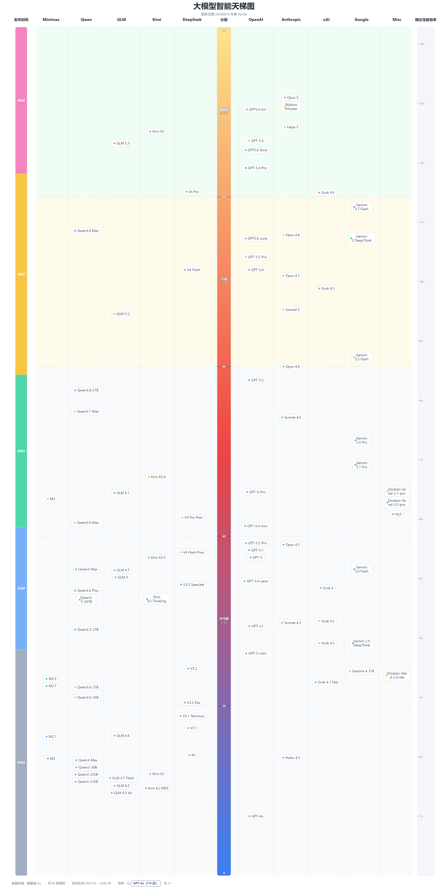

# 大模型智能天梯图（LLM Ladder Table）

一个追踪 2025-07 至 2026-08 大模型智能水平变化的个人项目，以"天梯图"形式可视化模型排名。

> ⚠️ 本项目是个人娱乐项目，无法与专业评测相比，不能很好地实际代表模型的水平，切勿当真。详细说明见 [docs/README.md](docs/README.md)。



## 功能

- 基于 HLE、AA、DeepSWE、致知个人榜单等评测数据综合折算
- 多维 KNN + 线性插值将老模型对齐到当前天梯
- 斜率线性映射突出高分模型的实际智能差距
- 纯静态页面（单 HTML + JS 数据组件），支持本地 `file://` 直接打开

## 快速开始

直接双击打开 `index.html` 即可查看天梯图（无需服务器）。

修改数据后重新生成数据组件：

```bash
python build_data.py
```

该脚本读取同目录 `数据源.csv`，生成 `数据源.js` 供页面加载。

## 目录结构

```
├── index.html          # 天梯图页面（SVG 可视化）
├── 数据源.csv           # 主要数据源
├── 数据源.js            # 由 build_data.py 生成，勿手改
├── build_data.py        # 数据构建脚本
├── 预览图.png           # 效果预览图
├── data/               # 原始数据与处理脚本
└── docs/               # 项目说明与参考资料
```

## 数据来源与致谢

详见 [docs/README.md](docs/README.md)。

- AA 榜单：剔除不合理幻觉率惩罚后的改良版（思路借鉴知乎两位大佬的文章）
- 致知个人榜单：[toyama nao 的 llm_benchmark](https://llm2014.github.io/llm_benchmark/)

## License

保留所有权利。如需转载或商用，请联系作者。
